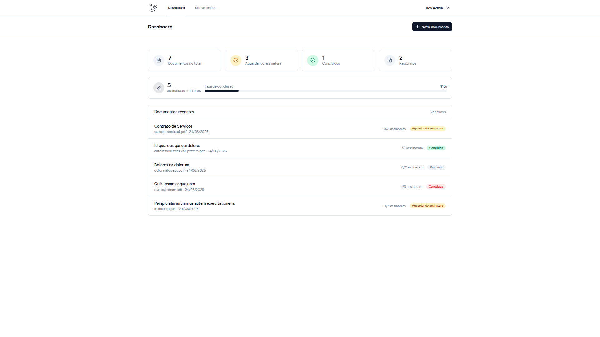
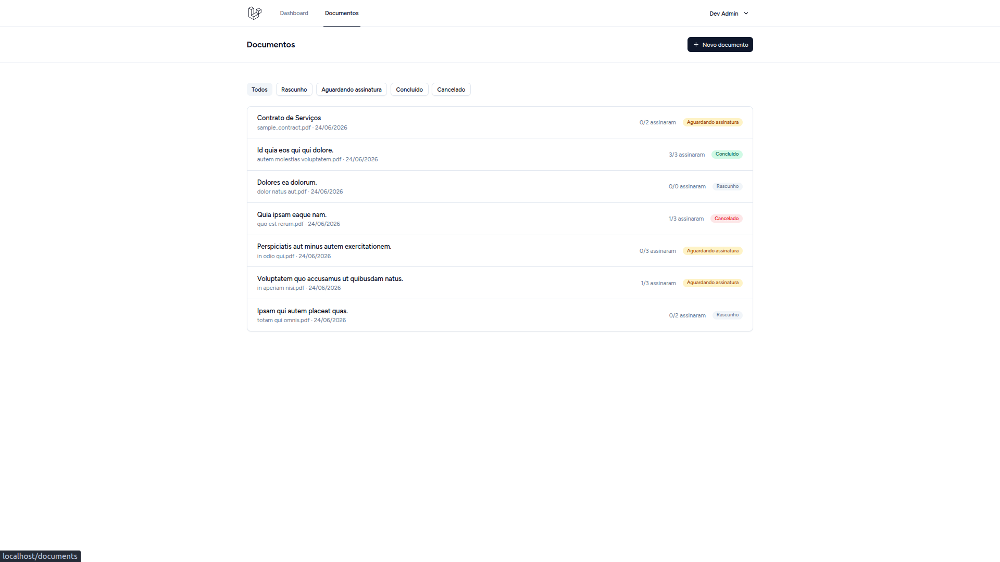
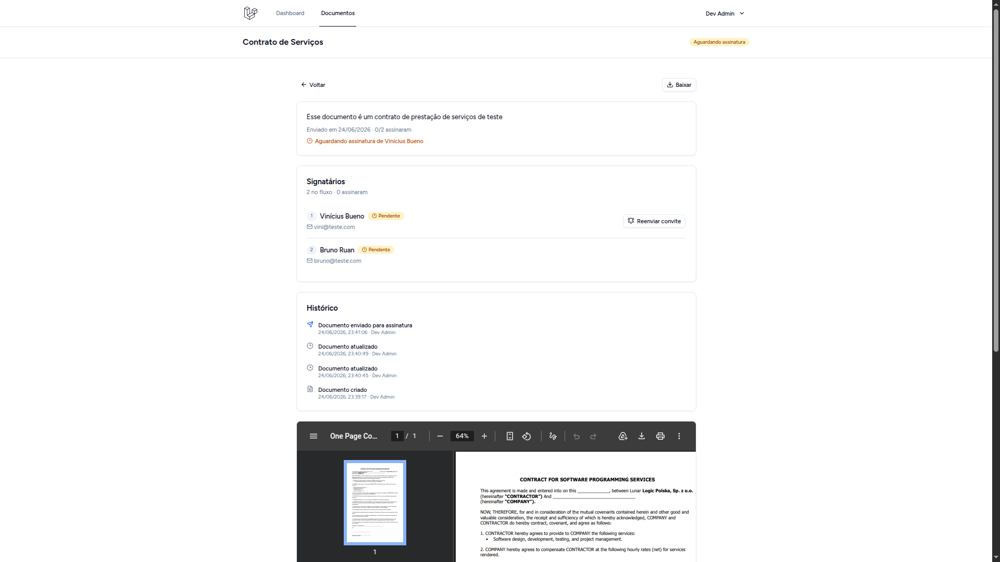
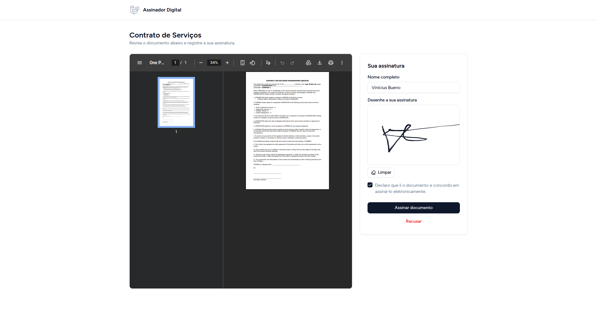
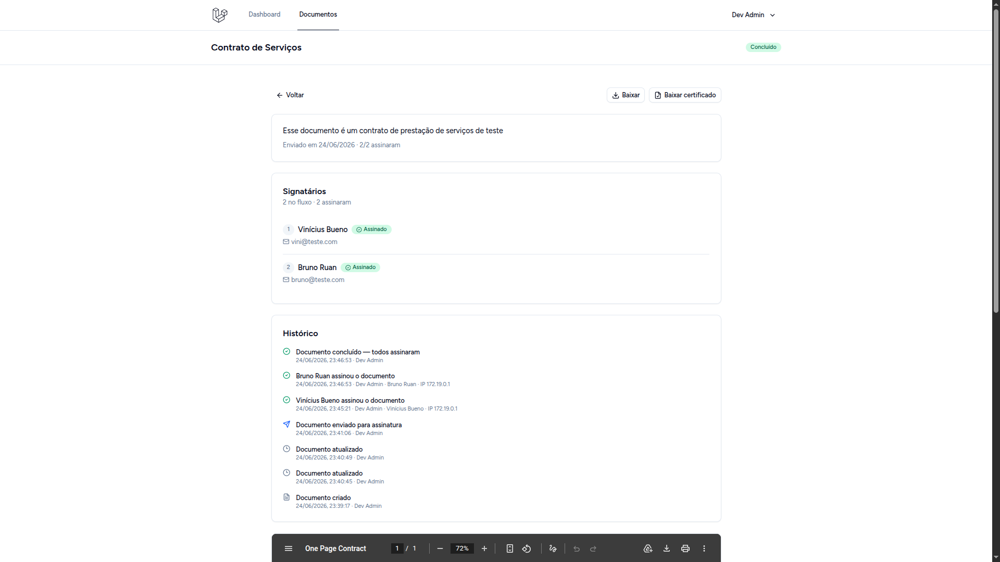
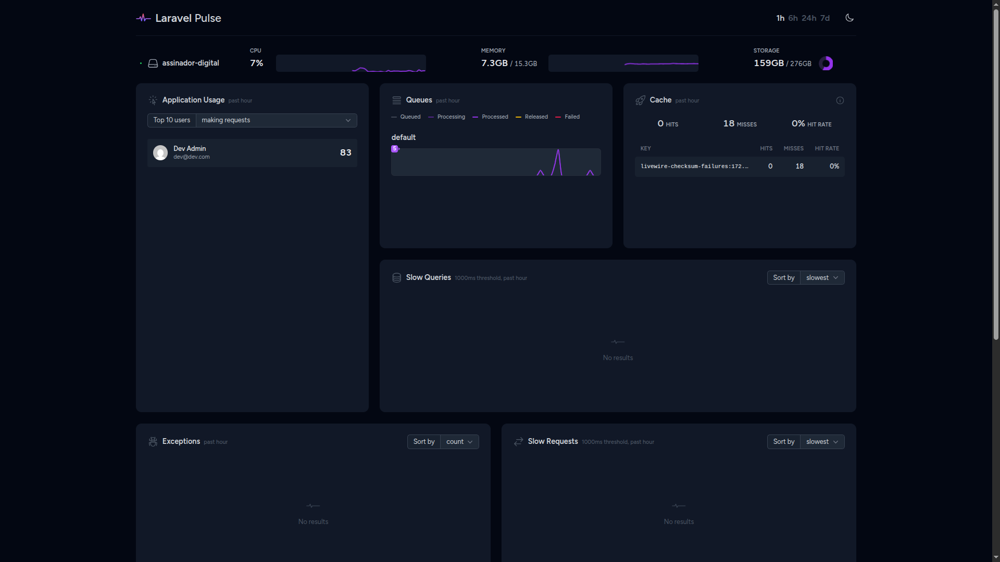
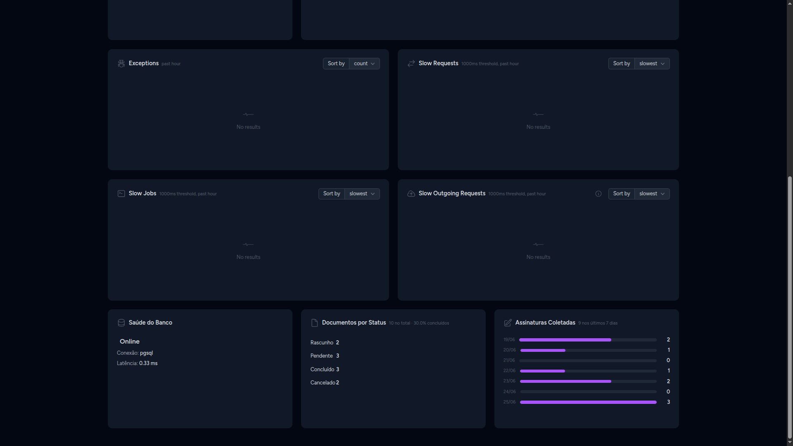

# Assinador Digital

Aplicação web para assinar PDFs por link. Você sobe um documento, define quem assina e em que ordem, e cada signatário recebe um e-mail com um link próprio para assinar no navegador, sem precisar de conta. No fim, o sistema gera um certificado de assinaturas em PDF e guarda toda a trilha de auditoria.

## Time

- Vinícius Bueno - [Github](https://github.com/Vinicius-b-oliveira)
- Bruno Ruan - [Github](https://github.com/eibrunoruan)

## O que ele faz

Um documento passa por três estados: rascunho, aguardando assinatura e concluído (ou cancelado, quando alguém recusa). Cada documento tem vários signatários numa ordem definida, e a assinatura é sequencial: o próximo só é convidado depois que o anterior assina. Quando o último assina, o documento conclui sozinho, o certificado é gerado, e tanto o dono quanto os signatários recebem uma cópia por e-mail com o certificado anexado.

No modelo de dados, um `Document` tem vários `Signatory`, e cada assinatura coletada vira um `Signature` (imagem da rubrica, nome, IP e data).

## Quick start

Pré-requisitos: **Docker** e **Docker Compose**. No macOS e Windows via Docker Desktop, no Linux via Docker Engine. No Windows, rode os comandos dentro do WSL2.

```bash
git clone git@github.com:Vinicius-b-oliveira/assinador-digital.git
cd assinador-digital

cp .env.example .env

# instala as dependências PHP sem precisar de PHP/Composer no host
docker run --rm -u "$(id -u):$(id -g)" -v "$(pwd)":/var/www/html -w /var/www/html \
  laravelsail/php85-composer:latest composer install --ignore-platform-reqs

./vendor/bin/sail up -d                         # app, Postgres, MinIO, Mailpit, pulse.check
./vendor/bin/sail pnpm install
./vendor/bin/sail artisan key:generate
./vendor/bin/sail artisan migrate:fresh --seed  # cria o schema e popula dados de exemplo
./vendor/bin/sail pnpm run build                # ou `pnpm run dev` durante o desenvolvimento
```

Num terminal separado, deixe o **worker de filas rodando**. Ele é obrigatório: os e-mails de convite e a geração do certificado são processados em fila.

```bash
./vendor/bin/sail artisan queue:work
```

O bucket do MinIO é criado sozinho no `sail up`, pelo serviço `minio-init`.

### Acessos

| Serviço       | URL                                               |
| ------------- | ------------------------------------------------- |
| App           | http://localhost                                  |
| Pulse (admin) | http://localhost/pulse                            |
| Mailpit       | http://localhost:8025                             |
| MinIO Console | http://localhost:8900 (login `sail` / `password`) |

### Credenciais

O seed cria um usuário administrador: **`dev@dev.com` / `password`**. Ele é dono dos documentos de exemplo e o único com acesso ao `/pulse`.

## Fluxo principal

O percurso completo da aplicação:

1. **Dashboard e documentos.** Ao logar você cai num painel com os indicadores dos seus documentos e a lista filtrável por status.

    
    

2. **Criar e enviar.** Suba um PDF, adicione os signatários na ordem desejada e envie. O primeiro recebe o convite por e-mail.

    

3. **Assinar pelo link.** O signatário abre o link do e-mail (visível no Mailpit em ambiente local), assina no canvas e confirma, sem login.

    

4. **Conclusão e certificado.** Depois que o último signatário assina, o documento conclui, o certificado é gerado e a trilha de auditoria fica disponível na tela.

    

5. **Observabilidade.** O `/pulse` reúne saúde do banco, uso de CPU e memória, requisições lentas e os indicadores de domínio.

    
    

## Arquitetura

A requisição flui por camadas com responsabilidades estreitas:

```
Request → FormRequest → Controller → Policy → Service → Model → DTO → Inertia::render()
```

- **Controllers finos:** validam via Form Requests, autorizam via Policies e delegam a regra para Services.
- **Services** concentram a regra de negócio: `DocumentService`, `SignatoryService`, `SigningService` e `SignatureCertificateService`.
- **DTOs** moldam o que vai pro frontend, sem expor o model cru.
- **Storage S3:** só o `DocumentStorageService` toca no disco, nunca `Storage::` solto pelo código. Em local, esse disco aponta para o MinIO.
- **Frontend** em Inertia + React 19 + TypeScript, com Tailwind v4 e shadcn/ui.

Stack: Laravel 13 · Inertia v2 + React 19 + TS · Tailwind v4 · shadcn/ui · PostgreSQL · MinIO (S3) · Mailpit · Laravel Pulse · Pest · Sail.

## Observabilidade

A telemetria fica no **Laravel Pulse** (`/pulse`, restrito a administradores pelo gate `viewPulse`):

- **Saúde do banco:** card próprio que mede a latência de um `SELECT 1` a cada render.
- **CPU e memória:** alimentados pelo serviço `pulse.check`, que já sobe junto no `sail up`. O fallback manual é `sail artisan pulse:check`.
- **Requisições lentas, queries lentas e exceções:** cards padrão do Pulse.
- **Indicadores de domínio:** documentos por status e assinaturas coletadas, agregados direto do banco.

## Testes e comandos

```bash
sail artisan test                # Pest
sail bin pint                    # formatação PHP
sail pnpm run lint               # ESLint + Prettier
sail pnpm run build              # build de produção
```
